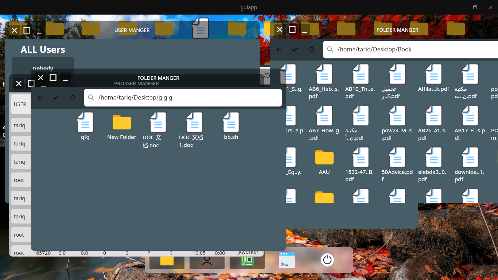
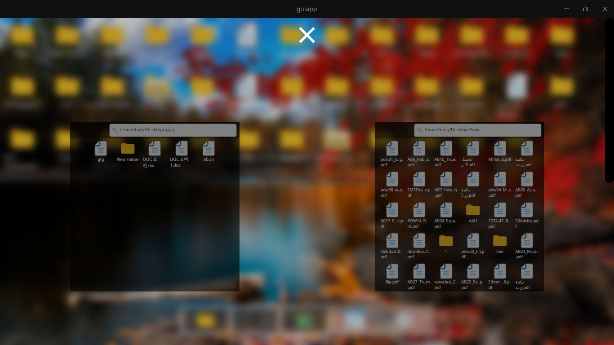
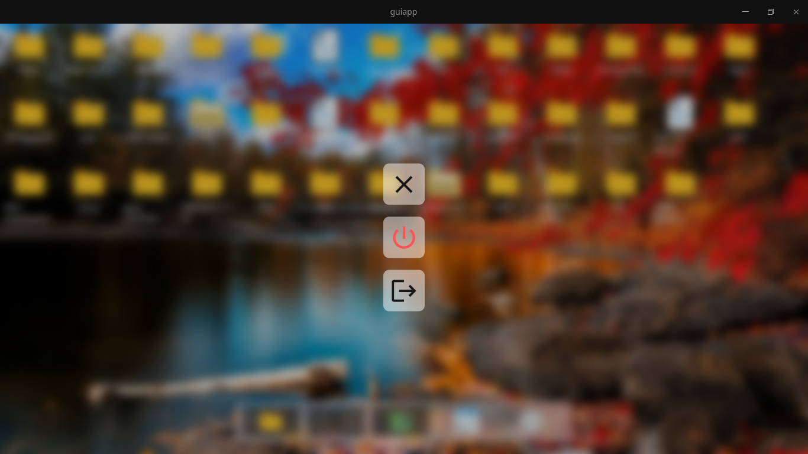

# Flutter Linux Server GUI

This project provides a graphical user interface (GUI) for accessing a Linux server through SSH. The interface is built using Flutter and does not require any additional libraries or installations on the server side.

## Features

- Secure SSH connection to Linux servers
- Graphical user interface for easy server management and monitoring
- Real-time server resource usage monitoring
- Customizable terminal settings
- No additional libraries or installations required on the server side

## Getting Started

To use this project, simply clone the repository and run the Flutter app. The app requires an SSH connection to a Linux server, which can be configured in the app settings.

|  |

# images

| :------: | :------: | :------: |
|  |  |  |

